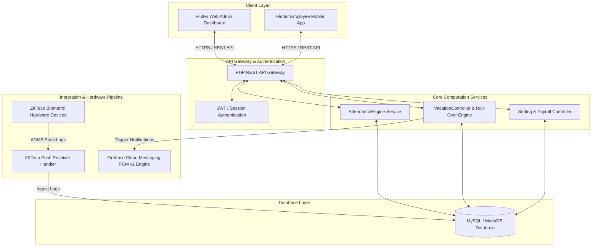
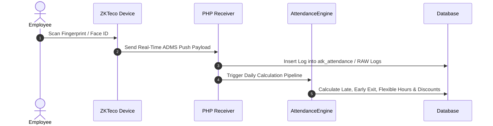
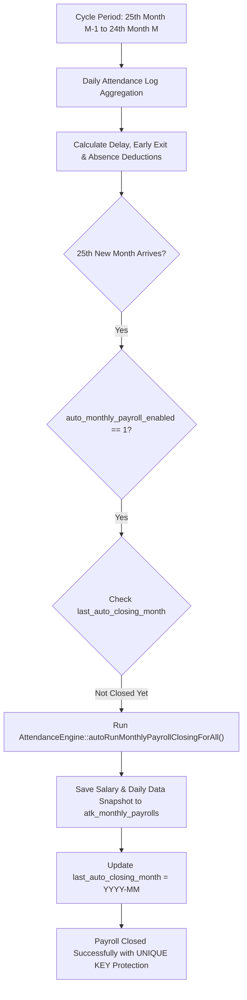
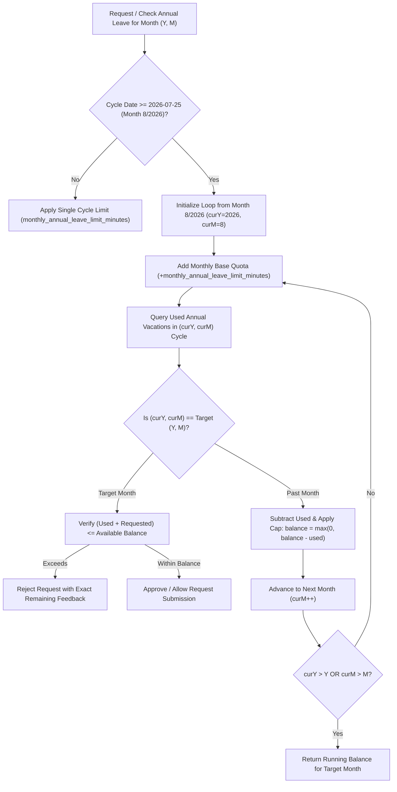
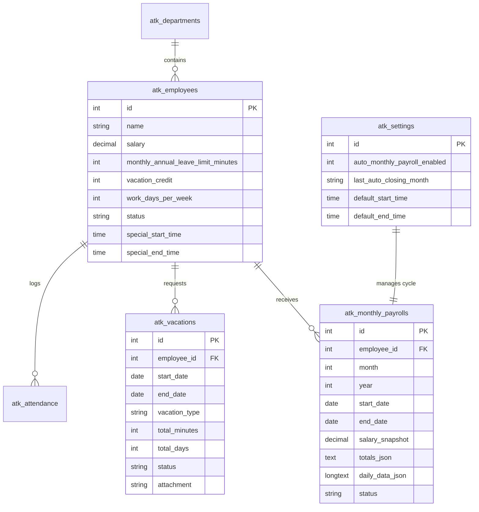

<div align="center">

# 🏢 ProAttend / Hadir (حاضر)
### Next-Generation Enterprise Attendance, Payroll & Leave Management System

[](https://flutter.dev)
[](https://dart.dev)
[](https://www.php.net)
[](https://www.mysql.com)
[](https://firebase.google.com)
[]()

<p align="center">
  <b>A state-of-the-art biometric workforce management solution featuring real-time hardware sync, automated monthly payroll closing, and an intelligent month-by-month capped roll-over annual leave engine.</b>
</p>

[Key Features](#-key-features) • [System Architecture](#-system-architecture) • [Core Engines](#-core-engines) • [Database Schema](#-database-schema) • [API Guide](#-api-endpoints) • [Setup Guide](#-getting-started)

---
</div>

## 🌟 Key Features

| Feature Module | Description & Capabilities |
| :--- | :--- |
| ⏱️ **Biometric Hardware Sync** | Real-time ADMS ingestion from ZKTeco fingerprint, facial recognition, and RFID hardware devices. |
| 💵 **Automated Payroll Engine** | Automatic monthly cycle closing (25th to 24th) with complete salary & attendance data snapshots. |
| 🌴 **Capped Roll-Over Leave Engine** | Month-by-month annual leave engine where positive unused limit rolls over, but past overages never penalize future months. |
| 🔔 **FCM v1 Push Notifications** | Instant alerts for leave requests, approvals, shift reminders, and admin announcements. |
| 📊 **Flexible & Fixed Shift Models** | Dynamic support for standard hours, flexible shifts, custom required hours, and minute-discount penalty rates. |
| 📱 **Cross-Platform UI** | High-performance Web Dashboard for Administrators & Responsive Mobile App for Employees. |

---

## 📐 System Architecture



---

## ⚡ Core Engines & Business Logic

### 1. Real-Time Biometric Log Ingestion Sequence



---

### 2. Monthly Payroll Cycle (25th to 24th) Flowchart



---

### 3. Month-by-Month Capped Annual Leave Roll-Over Engine



---

## 🗄️ Entity-Relationship Diagram (ERD)



---

## 📡 Key API Endpoints

| Method | Endpoint | Description | Role / Auth |
| :--- | :--- | :--- | :--- |
| `POST` | `/backend/index.php?route=login` | Employee & Admin Login | Public |
| `GET` | `/backend/index.php?route=employees` | Fetch List of Employees | Admin |
| `GET` | `/backend/index.php?route=attendance` | Query Attendance & Penalties | Admin / Employee |
| `POST` | `/backend/index.php?route=vacations` | Submit Vacation Request | Admin / Employee |
| `PUT` | `/backend/index.php?route=vacations/{id}` | Approve / Reject Vacation | Admin |
| `GET` | `/backend/index.php?route=settings` | Query System Settings | Admin |
| `PUT` | `/backend/index.php?route=settings` | Update Auto-Payroll Settings | Admin |

---

## 🚀 Getting Started

### 1. Prerequisites
- **Web Server**: Apache / Nginx with PHP 7.4+ or PHP 8.x
- **Database**: MySQL 5.7+ / MariaDB 10.4+
- **Development**: Flutter SDK 3.x+ & Dart 3.x+

### 2. Backend Setup
1. Clone the repository into your server root (`htdocs` or `/var/www/html`):
   ```bash
   git clone https://github.com/mohaba7ri/hadir_app.git attendace
   ```
2. Import Database Schema & Migrations:
   - Import `backend/database/schema.sql`.
   - Run migration: `backend/database/alter_auto_payroll_settings.sql`.
3. Configure `backend/database/db.php`:
   ```php
   private $local_db_name = "attendance";
   private $local_username = "root";
   private $local_password = "";
   ```

### 3. Frontend Setup
1. Open terminal in the `frontend` folder:
   ```bash
   cd frontend
   flutter pub get
   ```
2. Launch in Debug Mode:
   ```bash
   flutter run -d chrome
   ```
3. Build Web Production Bundle:
   ```bash
   flutter build web --release
   ```

---

<div align="center">
  <b>Built with ❤️ by ProAttend Engineering Team</b><br>
  <i>Proprietary Software - All Rights Reserved © 2026</i>
</div>
