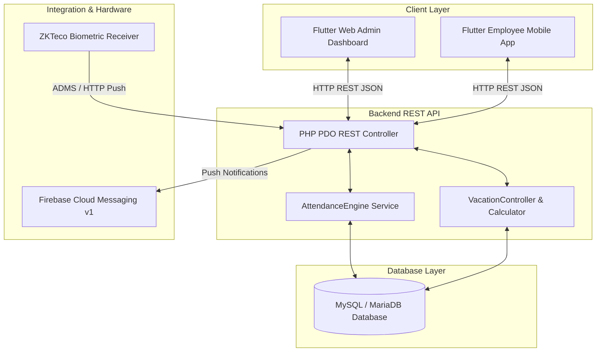
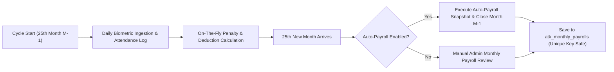
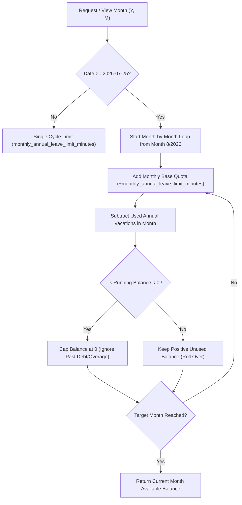
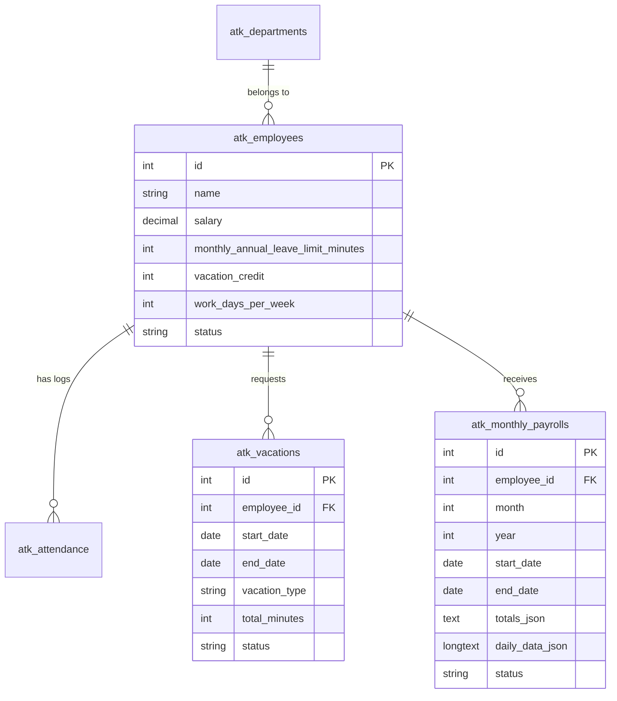

# 🏢 ProAttend / Hadir (حاضر) - Biometric Attendance & Payroll Management System

[](https://flutter.dev)
[](https://www.php.net)
[](https://www.mysql.com)
[]()

**ProAttend (حاضر)** is an enterprise-grade Attendance, Payroll, and Vacation Management Solution built with a modern **Flutter (Web & Mobile)** frontend, a high-performance **PHP PDO REST API** backend, and real-time **ZKTeco Biometric Hardware Receiver** integration.

---

## 🌟 Key Features

- ⏱️ **Biometric Hardware Sync**: Real-time attendance logs ingested directly from ZKTeco biometric fingerprint/face devices.
- 💵 **Automated Monthly Payroll Engine**: Automatic closing of payroll cycles on the 25th of every month with full snapshot preservation.
- 🌴 **Cumulative Roll-Over Annual Leave Engine**: Dynamic, month-by-month capped roll-over engine starting from Month 8/2026 (`2026-07-25`). Unused credit rolls over while past overages do not penalize future month quotas.
- 🔔 **FCM v1 Push Notifications**: Instant real-time alerts for leave approvals, attendance updates, and administrative notices.
- 📊 **Flexible & Standard Shift Models**: Custom work schedules, flexible required hours, dynamic minute-discount penalty rates, and automatic early exit/late calculations.
- 📱 **Cross-Platform**: Responsive Web Admin Dashboard and Mobile App (Android/iOS) for Employees.

---

## 📐 System Architecture



---

## 🔄 Monthly Payroll Cycle (25th to 24th)

The payroll cycle runs from the **25th of Month $M-1$** to the **24th of Month $M$**.



---

## 🌴 Cumulative Roll-Over Leave Engine

Effective from **Month 8 of 2026 (`2026-07-25`)**, the leave engine dynamically calculates remaining limits on the fly:



---

## 🗄️ Database Schema & Key Tables



---

## 🚀 Getting Started

### 1. Prerequisites
- **Web Server**: Apache / Nginx with PHP 7.4+ or PHP 8.x (XAMPP supported)
- **Database**: MySQL 5.7+ or MariaDB 10.4+
- **Frontend**: Flutter SDK 3.x+

### 2. Backend Installation
1. Clone the repository into your web server directory (`htdocs` or `/var/www/html`):
   ```bash
   git clone https://github.com/mohaba7ri/hadir_app.git attendace
   ```
2. Import the database schema:
   - Import `backend/database/schema.sql` into MySQL database `attendance`.
   - Run migration script: `backend/database/alter_auto_payroll_settings.sql`.

3. Configure database connection in `backend/database/db.php`:
   ```php
   private $local_db_name = "attendance";
   private $local_username = "root";
   private $local_password = "";
   ```

### 3. Frontend Installation
1. Navigate to the frontend directory:
   ```bash
   cd frontend
   flutter pub get
   ```
2. Run locally in debug mode:
   ```bash
   flutter run -d chrome
   ```
3. Build production web bundle:
   ```bash
   flutter build web --release
   ```

---

## 🛡️ License

Proprietary Software - All Rights Reserved © 2026 ProAttend / Hadir Team.
